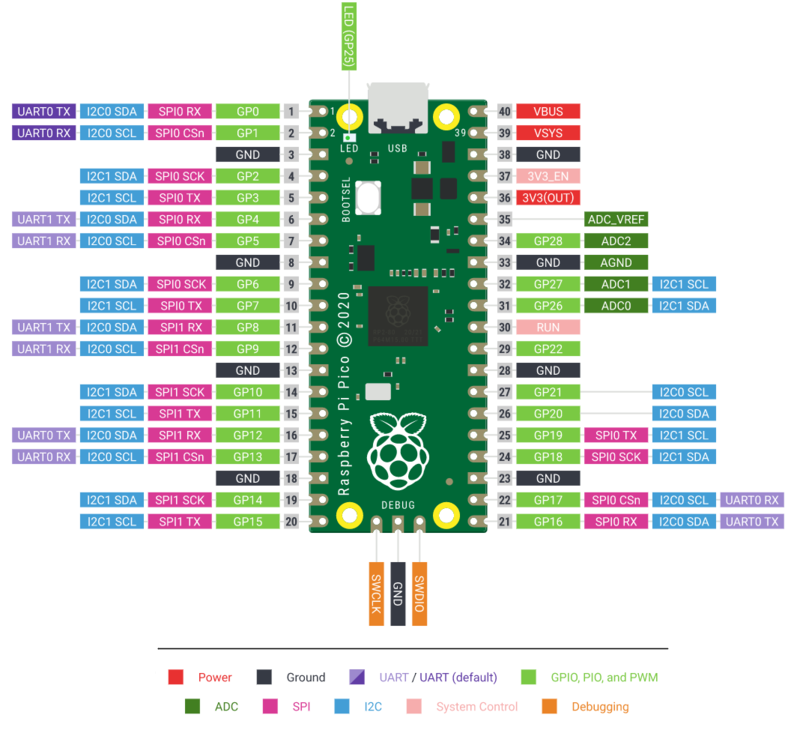
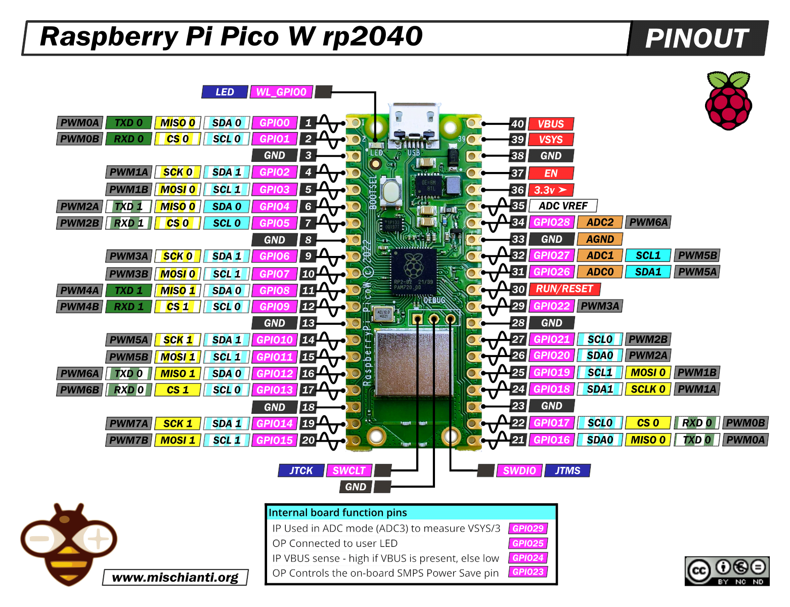

# Pass-L
Development for team E3 "Password"s final project - a two-factor, IoT safe for securing valuables.

The final design uses a raspberry pi pico 1 W running MicroPython.

Raspberry Pi Pico 1 pinout (used for testing):

Raspberry Pi Pico 1 W pinout (used in final design):

