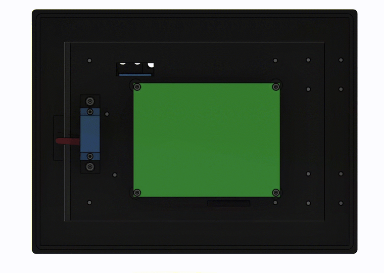
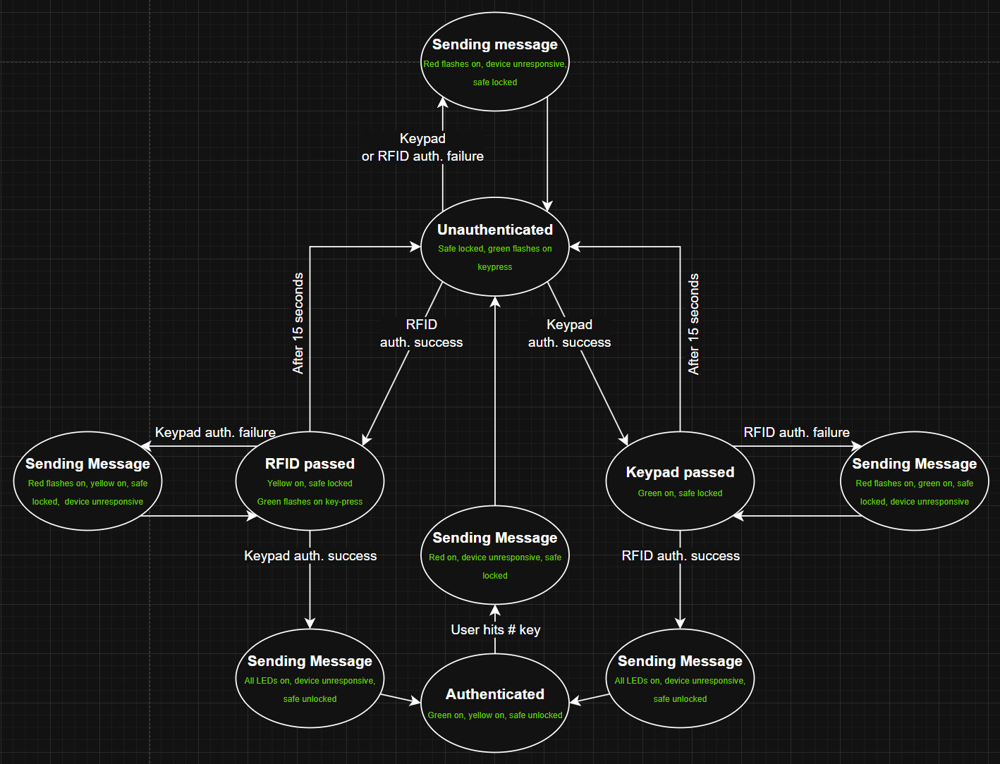
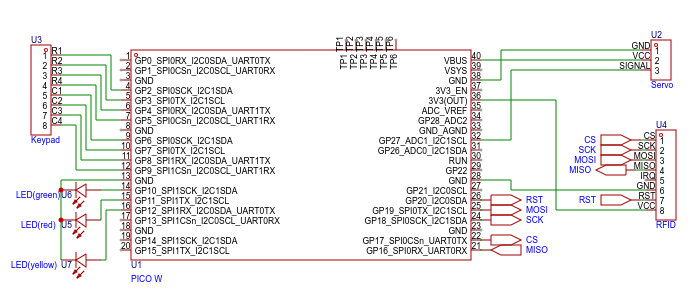

# Pass-L
Development for team E3 "Password"s final project - a two-factor, IoT safe for securing valuables.

The device's electronics include a Raspberry Pi Pico W running MicroPython connected to a keypad, RFID module, and servo motor. A 3D-printed enclosure surrounds the electronics and provides space for storing items.

# User guide
* To authenticate with the keypad, type in the correct password, then press the * key to enter it. If the password is correct, the green light will turn on. If you get it wrong, the red light will flash, and a push notification indicating an incorrect password will be sent. The green light will also flash whenever a key is registered by the system.

* To authenticate with the RFID, hold the keyfob close to the reader. If the keyfob is correct, the yellow light will turn on. If the wrong keyfob was scanned, the red light will flash, and a push notification indicating an incorrect scan will be sent.

* If one authentication method is completed successfully, you have 15 seconds to complete the other one, or else the method will relock, and you'll need to reauthenticate that method again.

* Once both authentication methods have been successfully completed within 15 seconds of eachother, the safe latch will open, and a push notification "Safe Unlocked!" will be sent.

* To lock the safe again, close the door and press the # key. The safe latch will close, a push notification "Safe Locked!" will be sent, and both authentication methods will relock.

* Sending a push notification takes some time. While the device is in the process of sending the notification, the red light will be solid-on. During this time, neither authentication method will work; the keypad will not register key presses and the RFID module will not scan any tags. Once the notification is done sending, the red light will turn off cleanly if the message was sent successfully, but blink a few times before turning off if there was an error sending the message. In the event the device can't connect to WiFi, it will still work normally, but push notifications will not send.

## Mechanical function demonstration:

## Logical Flow Diagram:

## Mechanical design exploded view:

## Electronics Schematic

## Raspberry Pi Pico 1 W pinout (used in final design):

## Raspberry Pi Pico 1 pinout (used for testing):

